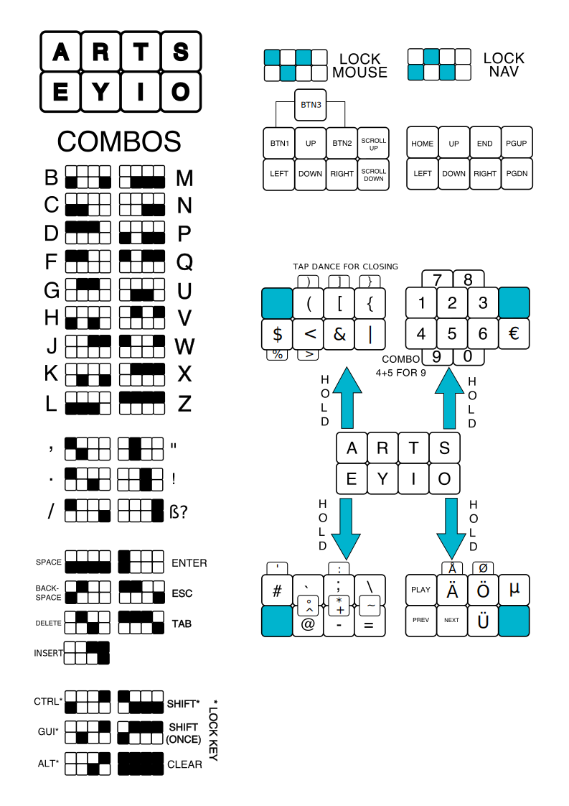

# ARTSEY

[artsey.io](https://artsey.io) v0.9.0, modified for German and to include almost every key one can dream of. Only ones missing that I am aware of are the F keys and PrntSc. The included Å and Ø require a custom keyboard layout on the OS side (AltGr + A and AltGr + O).

Complete firmware to flash to a dedicated Artsey build with `COL2ROW` diodes on a RP2040-zero using pins `GP29`, `GP28` for rows and `GP1`, `GP2`, `GP3`, `GP4` for columns.

